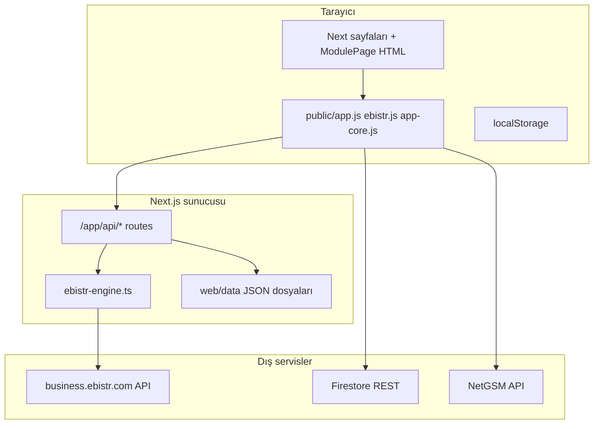

# Alibey Lab ERP (cari-3)

Bu depo, **Alibey Beton Çelik Laboratuvarı** için geliştirilmiş hibrit bir ERP / operasyon panelidir. Aynı kod tabanında hem modern **Next.js** uygulaması hem de eski **tek sayfa + global JavaScript** modülleri bir arada çalışır. Projeyi başka bir geliştirici veya Cursor hesabına aktarırken bu dosyayı baştan sona okumak, mimariyi ve riskleri anlamak için yeterli olmalıdır.

---

## İçindekiler

1. [Ne işe yarar?](#1-ne-işe-yarar)
2. [Depo yapısı](#2-depo-yapısı)
3. [Teknoloji yığını](#3-teknoloji-yığını)
4. [Hızlı başlangıç](#4-hızlı-başlangıç)
5. [Mimari genel bakış](#5-mimari-genel-bakış)
6. [Next.js uygulaması (`web/`)](#6-nextjs-uygulaması-web)
7. [EBİSTR entegrasyonu](#7-ebi̇str-entegrasyonu)
8. [API uçları özeti](#8-api-uçları-özeti)
9. [Veri ve kalıcılık](#9-veri-ve-kalıcılık)
10. [Ön yüz: stil ve davranış](#10-ön-yüz-stil-ve-davranış)
11. [Harici bileşenler](#11-harici-bileşenler)
12. [Ortam değişkenleri ve gizliler](#12-ortam-değişkenleri-ve-gizliler)
13. [Bilinen tuzaklar ve hata ayıklama](#13-bilinen-tuzaklar-ve-hata-ayıklama)
14. [Güvenlik uyarıları](#14-güvenlik-uyarıları)
15. [Yeni geliştirici için kontrol listesi](#15-yeni-geliştirici-için-kontrol-listesi)

---

## 1. Ne işe yarar?

Sistem şu iş alanlarını kapsar (menü ve sayfa yapısıyla uyumlu):

| Alan | Açıklama |
|------|----------|
| **Dashboard** | Özet metrikler, görev listesi, aktivite logları, kür havuzu sıcaklık özeti |
| **Müşteriler** | Cari / fiyatlandırma / teklif geçmişi / sözleşme |
| **Personel** | Bordro, liste, maaş özeti, izin, performans |
| **Saha** | Beton programı, araçlar |
| **Rapor** | Rapor defteri |
| **EBİSTR** | Numune analizi, yaklaşan kırımlar, yapı denetim, kürleme, telemetri, ayarlar |
| **Çip** | EBİS çip bakiyeleri, SMS/WhatsApp, sipariş takibi, mesaj geçmişi |
| **Ayarlar** | API (NetGSM vb.), yedekleme, Firestore aktarımı, sistem logları |

Kritik dış bağımlılık: **EBİSTR** (`business.ebistr.com`) API’si; token ile numune, tag, telemetri ve alarm verisi çekilir.

---

## 2. Depo yapısı

```
cari-3/
├── README.md                 ← Bu dosya (proje kökü)
├── package.json              ← Eski Node proxy için (ebistr-proxy.js vb.)
├── ebistr-proxy.js           ← (varsa) bağımsız EBİSTR proxy sunucusu
├── netgsm_proxy.php          ← NetGSM için PHP proxy (SMS gönderim/rapor/bakiye)
├── ebistr-extension 4/       ← Tarayıcı eklentisi (Chrome) — EBİSTR oturum/token
├── web/                      ← Asıl üretim uygulaması (Next.js)
│   ├── app/                  ← App Router sayfaları ve API route’ları
│   ├── components/           ← React shell (Sidebar, ClientLayout, Telemetri…)
│   ├── lib/ebistr-engine.ts   ← Sunucu tarafı EBİSTR sync motoru
│   ├── public/               ← app.js, app-core.js, ebistr.js, app.css, xlsx.js
│   ├── data/                 ← JSON cache, sözleşme, rapor defteri vb.
│   └── package.json
└── … (diğer kök dosyalar)
```

- **Asıl geliştirme hedefi:** `web/` dizini.
- **Kök `package.json`:** Tarihsel / alternatif `ebistr-proxy` çalıştırmak için; günlük geliştirme çoğunlukla `web/` içindedir.

---

## 3. Teknoloji yığını

| Katman | Teknoloji |
|--------|-----------|
| Framework | **Next.js 16** (App Router), **React 19** |
| Stil | **Tailwind CSS 4** (`@import "tailwindcss"` in `globals.css`) + **büyük legacy `public/app.css`** |
| Dil | **TypeScript** (sayfalar, API, `ebistr-engine`) + **vanilla JS** (`public/app.js`, `ebistr.js`, …) |
| Sunucu verisi | **Dosya sistemi** (`web/data/*.json`), **in-memory + dosya** (`ebistr_cache.json`, token dosyası) |
| Harici API | EBİSTR REST, NetGSM (PHP proxy veya doğrudan), isteğe bağlı **Resend** (mail route) |
| İstemci senkron | **Firestore REST** (`public/app-core.js` / `app.js` içinde yapılandırma) |

---

## 4. Hızlı başlangıç

### Gereksinimler

- **Node.js** 20+ önerilir (Next 16 ile uyumlu).
- **npm** (veya pnpm/yarn).
- EBİSTR verisi için: geçerli **token** (eklenti veya API ile `setToken`).

### Web uygulamasını çalıştırma

```bash
cd web
npm install
npm run dev
```

Tarayıcı: `http://localhost:3000`

Üretim:

```bash
cd web
npm run build
npm start
```

### (İsteğe bağlı) Kök proxy

Kök dizinde `npm start` → `ebistr-proxy.js` (depoda tanımlıysa). Next içindeki `/api/ebistr/*` ile işlev örtüşebilir; hangi ortamda hangisinin kullanıldığını netleştirin.

---

## 5. Mimari genel bakış



**Önemli:** İş mantığının büyük kısmı hâlâ **`public/app.js`** içinde; React sayfaları çoğunlukla **HTML string** + `dangerouslySetInnerHTML` ile bu DOM’u besler ve `onInit` ile global fonksiyonları tetikler.

---

## 6. Next.js uygulaması (`web/`)

### Giriş noktaları

| Dosya | Rol |
|-------|-----|
| `app/layout.tsx` | Metadata, `globals.css`, `ClientLayout`, global script’ler (`xlsx.js`, `app-core.js`, `app.js` — sürüm query ile cache bust) |
| `app/page.tsx` | Dashboard (inline HTML + `dashInit` vb.) |
| `app/**/page.tsx` | Modül sayfaları; çoğu `ModulePage` veya benzeri pattern |
| `components/ClientLayout.tsx` | Sidebar + `main` + mobil header + Telemetri bileşenleri |
| `components/Sidebar.tsx` | Navigasyon menüsü |
| `components/ModulePage.tsx` | `dangerouslySetInnerHTML` + `app.js` yüklenene kadar bekleme |

### Instrumentation

`instrumentation.ts` → Node runtime’ta `initEbistrEngine()` çağırır. Sunucu process’i ayakta kaldığı sürece periyodik EBİSTR sync zamanlanır.

### AGENTS.md / CLAUDE.md

Next sürümü eğitim verinizden farklı olabilir uyarısı içerir; API değişikliklerinde `node_modules/next/dist/docs/` veya resmi Next 16 dokümantasyonuna bakın.

---

## 7. EBİSTR entegrasyonu

### Motor: `web/lib/ebistr-engine.ts`

- **API tabanı:** `https://business.ebistr.com/api`
- **Token:** `web/data/ebistr_token.json` (veya bellekte `globalThis._ebistr`)
- **Cache:** `web/data/ebistr_cache.json` — numuneler, raw numuneler, taglar, telemetri, alarmlar, son senkron zamanları
- **İşlevler:** `performSync`, `syncTelemetriOnly`, `normalizeNumune`, `getStatus`, `getCache`, token ekleme/temizleme
- Numune çekimi tarih filtresi, sayfalama, BRN rapor haritası ile zenginleştirme, tag ve telemetri çekimi bu dosyada

### API route: `app/api/ebistr/[...slug]/route.ts`

Örnek uçlar:

- `GET .../status` — bağlantı ve cache özeti
- `POST .../setToken` — token kaydı + sync tetikleme
- `POST .../sync` — manuel sync
- `POST .../numuneler` — filtreli numune listesi
- `GET .../taglar` — çip/tag listesi (çip sayfası bunu kullanır; istemci önce `/api/ebistr/taglar` dener)
- `GET .../kurleme` — kürleme ekranı verisi
- `GET .../yaklasan` — yaklaşan kırım grupları
- CORS header’ları eklenti / cross-origin için açık olabilir

### Telemetri: `app/api/telemetri/route.ts`

Engine cache’inden telemetri döner; gerekirse `syncTelemetriOnly` tetiklenir.

---

## 8. API uçları özeti

| Route | Amaç |
|-------|------|
| `/api/ebistr/*` | EBİSTR proxy + sync + taglar + numuneler |
| `/api/telemetri` | Havuz sıcaklıkları / telemetri cache |
| `/api/data` | Generic JSON okuma/yazma/merge (`web/data`) |
| `/api/rapor` | Rapor defteri |
| `/api/sozlesme` | Sözleşme kayıtları + docx üretimi |
| `/api/mail/gonder` | Toplu mail (Resend SMTP — `RESEND_API_KEY`) |

---

## 9. Veri ve kalıcılık

### `web/data/` (dosya tabanlı)

- `ebistr_cache.json`, `ebistr_token.json`, `ebistr-numuneler.json` ve zaman damgalı yedekler
- `sozlesmeler.json`, `rapor-defteri.json`, `sozlesme-taslak.docx`
- API route’ları bu dizine yazar; sunucuda yazma izni gerekir

### Firestore (istemci)

`public/app.js` / `app-core.js` içinde **Firebase proje bilgileri ve API key** ile REST çağrıları yapılır. Koleksiyon örnekleri: `chip_data`, `chip_orders`, `hr_personnel`, `hr_payroll`, `msg_log`, `logs`, `sys_config`, vb.

### localStorage

Çip, rehber, kullanıcı oturumu, yedekler vb. tarayıcıda saklanır; cihazlar arası senkron için Firestore kullanılır.

---

## 10. Ön yüz: stil ve davranış

### İki katmanlı CSS

1. **`app/globals.css`** — Tailwind import, `:root` token’lar, sidebar, `.card`, `.btn`, `.ph`, mobil kurallar, sonradan eklenen “UI refresh” kuralları
2. **`public/app.css`** — Eski monolitik ERP stilleri; birçok sınıf burada da tanımlı; **çakışma ve override** sırası layout’ta `app.css` link sırasına bağlı

**Kural:** Görsel değişiklik yaparken hem `globals.css` hem `app.css` etkisini kontrol edin; spesifikite ve yükleme sırası farklı sonuç verebilir.

### Global script’ler

| Dosya | Rol |
|-------|-----|
| `app-core.js` | Firestore REST, `fsGet`, `fsSet`, temel yardımcılar |
| `app.js` | Ana ERP: çip, cari, maaş, ayarlar, sipariş, SMS proxy çağrıları, çoğu `innerHTML` |
| `ebistr.js` | EBİSTR analiz tablosu, filtreler, mail önizleme vb. |
| `xlsx.js` | Excel export |
| `kurleme-init.js` | Kürleme sayfası init |

### ModulePage ve hydration

Bazı sayfalar `ModulePage` ile SSR + client’ta farklı HTML riski taşır. `chip` sayfasında `dynamic(..., { ssr: false })` kullanımı gibi çözümler uygulanmış olabilir. Yeni modül eklerken:

- Aynı HTML’i server ve client’ta üretin veya
- `ssr: false` / `suppressHydrationWarning` stratejisi kullanın

---

## 11. Harici bileşenler

### `netgsm_proxy.php`

- NetGSM: bakiye (XML POST), SMS gönderim (GET), rapor sorgu (GET, normalize edilmiş yanıt)
- Canlı ortamda tarayıcıdan doğrudan NetGSM’e gitmek yerine bu proxy kullanılır (`app.js` içinde `netgsm_proxy.php` URL’leri)

### `ebistr-extension 4/`

Chrome eklentisi; EBİSTR oturumundan token alıp backend’e iletme senaryosu için. Detay için eklenti içi `manifest.json` ve `background.js` incelenmeli.

---

## 12. Ortam değişkenleri ve gizliler

| Değişken | Kullanım |
|----------|----------|
| `RESEND_API_KEY` | `web/app/api/mail/gonder/route.ts` — yoksa mail endpoint hata döner |
| EBİSTR token | Dosya veya `POST /api/ebistr/setToken`; repoda **asla** gerçek token commit etmeyin |

**Not:** Firestore `apiKey` şu an client kodunda gömülü; production’da kısıtlı key ve güvenlik kuralları şarttır.

---

## 13. Bilinen tuzaklar ve hata ayıklama

| Sorun | Olası neden |
|-------|-------------|
| Çip “EBİSTR’den çek” bağlantı hatası | Eski `localhost:3737` yerine `/api/ebistr/taglar` kullanılmalı; sunucu çalışıyor mu, token var mı |
| Telemetri eski kalıyor | Engine sync aralığı, `syncTelemetriOnly` ve cache; token süresi |
| Hydration uyarıları | `ClientLayout` mobil blok, `ModulePage` HTML farkı, eklenti DOM müdahalesi |
| `payrollMonth` null | Sayfa açık değilken `app.js` polling — null-check gerekir (düzeltmeler yapılmış olabilir) |
| Stil “hiç değişmedi” | `app.css` override; hard refresh veya `layout.tsx` script `?v=` parametreleri |

---

## 14. Güvenlik uyarıları

1. **Client’ta Firestore API key** — repo public ise risk; Firebase konsolda kısıtlama ve minimum yetki kullanın.
2. **NetGSM kimlik bilgileri** — ayarlar ekranında localStorage/Firestore’a yazılır; erişim kontrolü düşünün.
3. **CORS** — `/api/ebistr` geniş CORS ile açılmış olabilir; production’da sıkılaştırın.
4. **PHP proxy** — Kimlik bilgileri query string’de; HTTPS ve erişim kısıtlaması şart.

---

## 15. Yeni geliştirici için kontrol listesi

- [ ] `cd web && npm install && npm run dev`
- [ ] Ana akışlar: giriş (varsa), Dashboard, Çip CSV/proxy, EBİSTR token, bir API `GET /api/ebistr/status`
- [ ] `web/data` yazılabilir mi
- [ ] `instrumentation` ile engine logları (konsol)
- [ ] Hangi ortamda `netgsm_proxy.php` host ediliyor — `app.js` içindeki URL’ler
- [ ] Değişiklik yapılacak modül: **React mi yoksa `app.js` / HTML string mi?**
- [ ] Lint: `web` içinde `npm run lint` — legacy `public/*.js` dosyaları çok uyarı üretebilir

---

## Ek: Önemli dosya indeksi

| Yol | Açıklama |
|-----|----------|
| `web/app/layout.tsx` | Root layout, script ve CSS |
| `web/components/ClientLayout.tsx` | Uygulama kabuğu |
| `web/components/Sidebar.tsx` | Menü |
| `web/lib/ebistr-engine.ts` | EBİSTR sync |
| `web/app/api/**` | Tüm sunucu API’leri |
| `web/public/app.js` | Ana iş mantığı |
| `web/public/ebistr.js` | EBİSTR UI mantığı |
| `web/public/app.css` | Legacy global stiller |
| `web/app/globals.css` | Tailwind + modern token’lar |
| `netgsm_proxy.php` | NetGSM köprüsü |

---

## Bekleyen özellik (not — F058 kür su sıcaklığı + Word)

> **Durum:** Şablon repoda; otomatik doldurma / dışa aktarma henüz yok — aşağıdaki kurallar implementasyon için referans.

### Şablon dosyası

- Repo kökü: **`F058 KÜR TANKI-HAVUZU SU SICAKLIĞI TAKİP FORMU.doc`** (şu an klasik **`.doc`**).
- Otomasyon için çoğu araç **`.docx`** bekler; ileride şablon **`.docx`**’e aktarılıp (Word’den “Farklı Kaydet”) `web/data/` altına konabilir — sözleşme örneği: `web/app/api/sozlesme`, `web/data/sozlesme-taslak.docx`, `docxtemplater` vb.

### Ölçüm sıklığı ve saatler (önemli)

- Amaç: Kabaca **saatte bir** okuma (formun işleyişi); saatler **tam çizelgeye bağlı olmayacak**.
- **İstenmeyen:** Ardışık satırların hep aynı farkla gitmesi (ör. 11:27 → 12:27 gibi “makine saati” hissi).
- **İstenen:** Gerçek laboratuvar kullanımına uygun **dağınık zamanlar** — ölçüldüğü andaki saat yazılır (ör. `09:12`, `10:38`, `12:30`). Yani kayıt aralığı ~1 saat civarı olabilir; **timestamp her zaman gerçek ölçüm anı** (veya telemetrinin geldiği an) olmalı, `:00`’a yuvarlanmamalı.

### Sync yokken / telemetri kesilince

- **Telemetri sync açıkken:** `/api/telemetri` ve EBİSTR motor cache’inden gelen sıcaklık + **sunucunun bildiği zaman** (veya cihaz zamanı) satır olarak biriktirilebilir; yine de tabloya **ham zaman** yazılır, düzenli aralığa zorlanmaz.
- **Sync yok / oturum düşük:** Aynı mantık **elle** sürdürülür:
  - Geçici: Form yine Word’de elle; veya
  - Uygulama tarafında (hedef): `web/data/` veya istemci `fs*` ile **JSON satır listesi** (`zaman ISO`, `sicaklik`, isteğe `not`) — sync gelince birleştirme veya Word üretiminde kullanılır.
- Özet: **Tek doğruluk kaynağı** ölçüm anındaki değer; ağ yoksa önce yerel kayıt, sonra mümkün olduğunda dışa aktarma.

### Hedef ürün davranışı (ileride)

- Şablondaki alanlar netleştikten sonra: sistem bu veriyi **alan eşlemesiyle** doldurup kullanıcının indirebileceği **`.docx`** üretir; saat sütunları yukarıdaki gibi **gerçekçi, düzensiz** zaman damgalarıyla dolar.

---

## Lisans ve iletişim

Bu README teknik aktarım içindir. Lisans ve kurumsal iletişim bilgileri proje sahibi tarafından eklenmelidir.

---

*Son güncelleme: Bu README, projenin hibrit mimarisini ve operasyonel bağlamını yeni bir Cursor / geliştirici oturumunda yeniden kurmak için yazılmıştır.*
